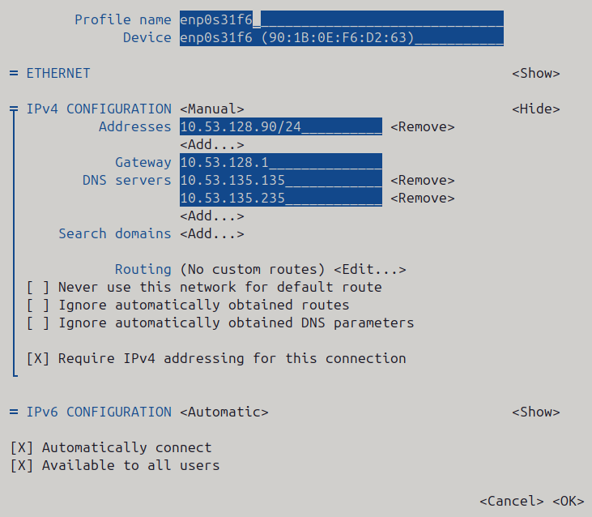

# Pre-provisioning

# Step 1:  Install OS on Management Node

we will Install Rocky Linux

Make sure to update the package manager first thing:

```bash
sudo dnf update
sudo dnf upgrade
```

---

# Step 2: Edit the Network Configuration

## 1. Open Network configuration

```bash
sudo nmtui
```

## 2. Open the Settings of Ethernet

> Edit a connection —> enp0s31f6
>

## 3. Edit the Connection like the following



## 4. Back to Network Manger TUI page

> OK —> Back
>

## 5. Activate a connection

> Activate a connection —> Deactivate —> Activate
>

---

#

# Slurm

scontrol update NodeName=cn1 State=RESUME

# Step 1: Create global user accounts

- do this on the **management node** and the **compute node**

```bash
export MUNGEUSER=1005
groupadd -g $MUNGEUSER munge
useradd  -m -c "MUNGE Uid 'N' Gid Emporium" -d /var/lib/munge -u $MUNGEUSER -g munge  -s /sbin/nologin munge
export SlurmUSER=1001
groupadd -g $SlurmUSER slurm
useradd  -m -c "Slurm workload manager" -d /var/lib/slurm -u $SlurmUSER -g slurm  -s /bin/bash slurm
```

<aside>
💡

**Very important:  Avoid UID and GID values below 1000**, as defined in the standard configuration file `/etc/login.defs` by the parameters `UID_MIN, UID_MAX, GID_MIN, GID_MAX`

</aside>

<aside>
🚨

Important: Make sure that these same users are created identically on all nodes. User/group creation must be done prior to installing RPMs (which would create random UID/GID pairs if these users don’t exist).

</aside>

---

# Step 2: Munge authentication service

## Install the latest Munge version

```bash
dnf install -y openssl-devel zlib-devel
wget https://github.com/dun/munge/releases/download/munge-0.5.16/munge-0.5.16.tar.xz
rpmbuild -ta munge-0.5.16.tar.xz
```

```bash
dnf install ~/rpmbuild/RPMS/x86_64/munge-0.5.16-*.rpm \
             ~/rpmbuild/RPMS/x86_64/munge-libs-0.5.16-*.rpm \
             ~/rpmbuild/RPMS/x86_64/munge-devel-0.5.16-*.rpm
```

---

# Step 3: Munge configuration and testing

to test munge run these:

```jsx
munge -C
munge -M
```

---

# Step 4: Generate the Munge key

```bash
# on MN
mungekey --create --verbose
```

 on CN

```bash
mkdir /etc/munge
mkdir /var/log/munge/
```

on MN

```bash
xdcp cn1 /etc/munge/munge.key /etc/munge/
```

Make sure to set the correct ownership and mode on all nodes:

```bash
chown -R munge: /etc/munge/ /var/log/munge/
chmod 0700 /etc/munge/ /var/log/munge/
```

---

# Step 5: Test the Munge service

restart the munge service:

```jsx
systemctl daemon-reload
systemctl restart munge
```

Run some tests as described in the Munge_installation guide:

```bash
munge -n
munge -n | unmunge          # Displays information about the Munge key
munge -n | ssh cn1 unmunge
remunge
```

---

# Step 6: Build Slurm RPMs

## Install prerequisites On Management Node

```bash
dnf config-manager --set-enabled powertools # EL8
dnf install epel-release
dnf clean all
```

```bash
dnf install mariadb-server mariadb-devel
dnf install rpm-build gcc python3 openssl openssl-devel pam-devel numactl numactl-devel hwloc hwloc-devel lua lua-devel readline-devel rrdtool-devel ncurses-devel gtk2-devel libibmad libibumad perl-Switch perl-ExtUtils-MakeMaker xorg-x11-xauth dbus-devel libbpf bash-completion
```

```bash
dnf install libssh2-devel man2html
dnf install -y autoconf automake
```

## Build Slurm packages

```bash
wget https://download.schedmd.com/slurm/slurm-24.11.6.tar.bz2
```

```bash
export VER=24.11.6
rpmbuild -ta slurm-$VER.tar.bz2 --with mysql
```

## Install MariaDB database

```bash
dnf install mariadb-server mariadb-devel
```

<aside>
💡

If you plan to use [Ansible](https://www.ansible.com/) to manage the database, it will require this Python package:

```jsx
dnf install python3-mysql (EL8)
dnf install python3-PyMySQL (EL9)
```

</aside>

### Install slurmdbd package

Install the slurm database RPM on the database-only (slurmdbd service) node:

```jsx
export VER=24.11.6  # Use the latest version
cd ~/rpmbuild/RPMS/x86_64/
dnf install slurm-$VER*rpm slurm-devel-$VER*rpm slurm-slurmdbd-$VER*rpm
```

Explicitly enable the service:

```bash
systemctl enable slurmdbd
```

### **Set up MariaDB database**

Make sure the [MariaDB](https://mariadb.org/) packages were installed **before** you built the [Slurm](https://www.schedmd.com/) RPMs:

```bash
rpm -q mariadb-server mariadb-devel
rpm -ql slurm-slurmdbd | grep accounting_storage_mysql.so     # Must show location of this file
```

Now start the MariaDB service:

```bash
systemctl start mariadb
systemctl enable mariadb
systemctl status mariadb
```

<aside>
💡

if get get the next error `Sep 29 15:53:11 [xcatmn.cluster.com](http://xcatmn.cluster.com/) systemd[1]: Failed to start MariaDB 10.3 database server.`

```bash
ps aux | grep -iE 'mysql|mariadb'

pkill -9 mysqld

rm -f /var/lib/mysql/mysql.sock

systemctl start mariadb
systemctl status mariadb
```

</aside>

<aside>
💡

Make sure to configure the [MariaDB](https://mariadb.org/) database’s **root password** as instructed at first invocation of the *mariadb* service, or run this command:

</aside>

```jsx
/usr/bin/mysql_secure_installation
```

To enter MariaDB shell run:

```bash
mysql -u root -p
```

To create a new db user in the database run :

```bash
grant all on slurm_acct_db.* TO 'slurm'@'localhost' identified by 'admin' with grant option;
SHOW GRANTS FOR 'slurm'@'localhost';
SHOW VARIABLES LIKE 'have_innodb';
create database slurm_acct_db;
quit;
```

You can verify the database grants for the *slurm* user:

```bash
*# mysql -p -u slurm*
show grants;
quit;
```

### **MySQL configuration**

create a new file `/etc/my.cnf.d/innodb.cnf` :

```bash
 nano /etc/my.cnf.d/innodb.cnf
```

and put these:

```bash
[mysqld]
innodb_buffer_pool_size=32768M
innodb_log_file_size=64M
innodb_lock_wait_timeout=900
```

To implement this change you have to shut down the database and move/remove logfiles:

```bash
systemctl stop mariadb
mv /var/lib/mysql/ib_logfile? /tmp/
systemctl start mariadb
```

You can check the current setting in MySQL like so:

```bash
*# mysql -p*SHOW VARIABLES LIKE 'innodb_buffer_pool_size';
SHOW VARIABLES LIKE 'innodb_log_file_size';
SHOW VARIABLES LIKE 'innodb_lock_wait_timeout';
quit;
```

# **Slurm database tables**

To view the status of the tables in the *slurm_acct_db* database:

```bash
*# mysqlshow -p --status slurm_acct_db*
```

It is possible to display the contents of the *slurm_acct_db* database:

```bash
*# mysql -p -u slurm slurm_acct_db*
```

## **SlurmDBD Configuration**

### Create slurmdbd.conf file:

```bash
mkdir -p  /etc/slurm
nano /etc/slurm/slurmdbd.conf
```

      and put these inside:

```jsx
#
# Slurm Database Daemon (slurmdbd) Configuration
#
AuthType=auth/munge
DbdHost=xcatmn.cluster.com
DbdPort=6819
DebugLevel=info
SlurmUser=slurm

# Database Credentials
StorageType=accounting_storage/mysql
StorageHost=localhost
StoragePort=3306
StorageUser=slurm
StoragePass=admin
StorageLoc=slurm_acct_db

# Archive & Purge Settings
ArchiveEvents=yes
ArchiveJobs=yes
ArchiveResvs=yes
ArchiveSteps=no
ArchiveSuspend=no
ArchiveTXN=no
ArchiveUsage=no
PurgeEventAfter=1month
PurgeJobAfter=12month
PurgeResvAfter=1month
PurgeStepAfter=1month
PurgeSuspendAfter=1month
PurgeTXNAfter=12month
PurgeUsageAfter=24month

# Logging & Runtime Files
LogFile=/var/log/slurm/slurmdbd.log
PidFile=/var/run/slurmdbd.pid

```

Set up files and permissions:

```bash
chown slurm: /etc/slurm/slurmdbd.conf
chmod 600 /etc/slurm/slurmdbd.conf
mkdir /var/log/slurm
touch /var/log/slurm/slurmdbd.log
chown slurm: /var/log/slurm/slurmdbd.log
```

### **Start the slurmdbd service**

First try to run *slurmdbd* manually to see the log:

```bash
slurmdbd -D -vvv
```

Terminate the process by Control-C when the testing is OK.

Start the slurmdbd service:

```bash
systemctl enable slurmdbd
systemctl start slurmdbd
systemctl status slurmdbd
```

# Step 7: Installing RPMs

Important: Make sure that these same users are created identically on all nodes. User/group creation must be done prior to installing RPMs (which would create random UID/GID pairs if these users don’t exist).

## On MN:

```bash
export VER=24.11.6
dnf install slurm-$VER*rpm slurm-devel-$VER*rpm slurm-perlapi-$VER*rpm slurm-torque-$VER*rpm slurm-example-configs-$VER*rpm
dnf install slurm-slurmctld-24.11.6-1.el8.x86_64.rpm
systemctl enable slurmctld
```

Create the spool and log directories and make them owned by the slurm user:

```bash
mkdir /var/sp
ool/slurmctld /var/log/slurm
chown slurm: /var/spool/slurmctld /var/log/slurm
chmod 755 /var/spool/slurmctld /var/log/slurm
```

Create log files:

```bash
touch /var/log/slurm/slurmctld.log
chown slurm: /var/log/slurm/slurmctld.log
```

- Servers which should offer slurmrestd should install also this package:

    ```bash
    dnf install slurm-slurmrestd-$VER*rpm
    ```

## On CN:

```bash
export VER=24.11.6
dnf install slurm-slurmd-$VER* slurm-pam_slurm-$VER*
systemctl enable slurmd
```

Create the slurmd spool and log directories and make the correct ownership:

```bash
mkdir /var/spool/slurmd /var/log/slurm
chown slurm: /var/spool/slurmd  /var/log/slurm
chmod 755 /var/spool/slurmd  /var/log/slurm
```

Create log files:

```bash
touch /var/log/slurm/slurmd.log
chown slurm: /var/log/slurm/slurmd.log
```

You may consider this RPM as well with special PMIx libraries:

```bash
dnf install slurm-libpmi-$VER*
```

# Step 8: Configure Slurm logging

```bash
nano /etc/slurm/slurm.conf
```

- old

    ```bash
    #
    # Sample /etc/slurm.conf for mcr.llnl.gov
    #
    #SlurmctldHost=mcri(10.53.90.90)
    SlurmctldHost=xcatmn.cluster.com
    #
    ClusterName=cluster
    #ControlMachine=xcatmn.cluster.com

    AuthType=auth/munge
    #Epilog=/usr/local/slurm/etc/epilog
    JobCompLoc=/var/tmp/jette/slurm.job.log
    JobCompType=jobcomp/filetxt
    #PluginDir=/usr/local/slurm/lib/slurm
    #Prolog=/usr/local/slurm/etc/prolog
    SchedulerType=sched/backfill
    SelectType=select/linear
    SlurmUser=slurm
    SlurmctldPort=7002
    SlurmctldTimeout=300
    SlurmdPort=7003
    SlurmdSpoolDir=/var/spool/slurmd.spool
    SlurmdTimeout=300
    StateSaveLocation=/var/spool/slurm.state
    TreeWidth=16
    #
    SlurmctldLogFile=/var/log/slurm/slurmctld.log
    SlurmdLogFile=/var/log/slurm/slurmd.log
    SlurmSchedLogFile=/var/log/slurm/slurmsched.log
    MailProg=/bin/true
    #
    # Node Configurations
    #
    NodeName=cn1 CPUs=8 RealMemory=23000 TmpDisk=64000 State=UNKNOWN
    #NodeName=cn1 NodeAddr=emcr[0-1151]
    #
    # Partition Configurations
    #
    PartitionName=DEFAULT State=UP
    PartitionName=pdebug Nodes=cn1 MaxTime=30 MaxNodes=32 Default=YES
    PartitionName=pbatch Nodes=cn1

    ```

```bash
# ====================================================================
# Slurm Control & General Configuration
# ====================================================================
ClusterName=cluster
SlurmctldHost=xcatmn.cluster.com

SlurmUser=slurm
SlurmctldPort=7002
SlurmdPort=7003

AuthType=auth/munge
StateSaveLocation=/var/spool/slurm.state
SlurmdSpoolDir=/var/spool/slurmd.spool

SlurmctldTimeout=300
SlurmdTimeout=300
TreeWidth=16

# ====================================================================
# Scheduling & Resource Allocation
# ====================================================================
SchedulerType=sched/backfill
SelectType=select/cons_tres
SelectTypeParameters=CR_Core_Memory

# ====================================================================
# Logging & Accounting Configuration
# ====================================================================
SlurmctldLogFile=/var/log/slurm/slurmctld.log
SlurmdLogFile=/var/log/slurm/slurmd.log
SlurmSchedLogFile=/var/log/slurm/slurmsched.log
JobCompType=jobcomp/filetxt
JobCompLoc=/var/tmp/slurm_job_completion.log
MailProg=/bin/true

# ====================================================================
# Node Configurations
# ====================================================================
NodeName=cn1 Sockets=2 CoresPerSocket=6 ThreadsPerCore=2 RealMemory=23000 TmpDisk=843160 State=UNKNOWN

# ====================================================================
# Partition Configurations
# ====================================================================
PartitionName=DEFAULT State=UP
PartitionName=pdebug Nodes=cn1 MaxTime=00:30:00 MaxNodes=1 Default=YES
PartitionName=pbatch Nodes=cn1 MaxNodes=1
```

```bash
mkdir /var/log/slurm
chown slurm.slurm /var/log/slurm
```

```bash
mkdir -p /var/tmp/jette
chown slurm:slurm /var/tmp/jette
chmod 755 /var/tmp/jette

systemctl restart slurmctld
systemctl status slurmctld
```

7. Create a **`synclist`** to copy repo config into nodes:

```bash
cat >/install/custom.synclist <<'EOF'
/etc/slurm/slurm.conf -> etc/slurm/slurm.conf
/etc/munge/munge.key -> /etc/munge/munge.key

EOF
```

8. Attach the synclist to your OS image:

```bash
chdef -t osimage rocky8.9-x86_64-install-compute synclists=/install/custom.synclist
```

# Step 9: Run first job in Slurm:

create a script file for the job:

```jsx
#!/bin/bash
#SBATCH --job-name=test
#SBATCH --nodes=1
#SBATCH --ntasks-per-node=1
#SBATCH --time=00:01:00
#SBATCH --output=output.txt
#SBATCH --error=error.txt

echo 'Your job is running on node(s):'
echo $SLURM_JOB_NODELIST
echo 'Cores per node:'
echo $SLURM_TASKS_PER_NODE  > output2.txt

```

then run these:

```jsx
sbatch test.sh
squeue               # check if the node entered the queue
cat output2.txt      # check the output file
```

On cn1

```bash
scontrol update NodeName=cn1 State=RESUME
```

## nano /install/postscripts/slurm.sh

```bash
#!/bin/bash
export MUNGEUSER=1005
groupadd -g $MUNGEUSER munge
useradd -m -c "MUNGE Uid 'N' Gid Emporium" -d /var/lib/munge -u $MUNGEUSER -g munge -s /sbin/nologin munge

export SlurmUSER=1001
groupadd -g $SlurmUSER slurm
useradd -m -c "Slurm workload manager" -d /var/lib/slurm -u $SlurmUSER -g slurm -s /bin/bash slurm

dnf install -y munge-0.5.16-* munge-libs-0.5.16-* munge-devel-0.5.16-*

chown -R munge:munge /etc/munge/ /var/log/munge/
chmod 0700 /etc/munge/ /var/log/munge/
chmod 0400 /etc/munge/munge.key

systemctl enable --now munge

export VER=24.11.6
dnf install -y slurm-slurmd-$VER* slurm-pam_slurm-$VER* slurm-libpmi-$VER*

mkdir -p /var/spool/slurmd /var/log/slurm
chown -R slurm:slurm /var/spool/slurmd /var/log/slurm
chmod 755 /var/spool/slurmd /var/log/slurm

touch /var/log/slurm/slurmd.log
chown slurm:slurm /var/log/slurm/slurmd.log

systemctl enable --now slurmd
```

## working sacct slurm.conf (same on MN and CN)

```bash
#
# Sample /etc/slurm.conf for mcr.llnl.gov
#
#SlurmctldHost=mcri(10.53.90.90)
SlurmctldHost=xcatmn.cluster.com
#
ClusterName=cluster
#ControlMachine=xcatmn.cluster.com

AuthType=auth/munge
Epilog=/usr/local/slurm/etc/epilog
JobCompLoc=/var/tmp/jette/slurm.job.log
JobCompType=jobcomp/filetxt
#PluginDir=/usr/local/slurm/lib/slurm
Prolog=/usr/local/slurm/etc/prolog
SchedulerType=sched/backfill
SelectType=select/linear
SlurmUser=slurm
SlurmctldPort=7002
SlurmctldTimeout=300
SlurmdPort=7003
SlurmdSpoolDir=/var/spool/slurmd.spool
SlurmdTimeout=300
StateSaveLocation=/var/spool/slurm.state
TreeWidth=16
#
SlurmctldLogFile=/var/log/slurm/slurmctld.log
SlurmdLogFile=/var/log/slurm/slurmd.log
SlurmSchedLogFile=/var/log/slurm/slurmsched.log
MailProg=/bin/true
#
AccountingStorageType=accounting_storage/slurmdbd
AccountingStorageHost=xcatmn.cluster.com
#AccountingStorageUser=slurm
#AccountingStoragePass=admin
#
# Node Configurations
#
NodeName=cn1 CPUs=12 RealMemory=63907 TmpDisk=920242 State=UNKNOWN
#NodeName=cn1 CPUs=8 RealMemory=23000 TmpDisk=64000 State=UNKNOWN
#NodeName=cn1 NodeAddr=emcr[0-1151]
#
# Partition Configurations
#
PartitionName=DEFAULT State=UP
PartitionName=pdebug Nodes=cn1 MaxTime=30 MaxNodes=32 Default=YES
PartitionName=pbatch Nodes=cn1

```

## cleaned up:

```bash
ClusterName=cluster
SlurmctldHost=xcatmn.cluster.com

AuthType=auth/munge
Epilog=/usr/local/slurm/etc/epilog
Prolog=/usr/local/slurm/etc/prolog
JobCompLoc=/var/tmp/jette/slurm.job.log
JobCompType=jobcomp/filetxt

SchedulerType=sched/backfill
SelectType=select/cons_res
SelectTypeParameters=CR_Core_Memory

SlurmUser=slurm
SlurmctldPort=7002
SlurmctldTimeout=300
SlurmdPort=7003
SlurmdSpoolDir=/var/spool/slurmd.spool
SlurmdTimeout=300
StateSaveLocation=/var/spool/slurm.state
TreeWidth=16

SlurmctldLogFile=/var/log/slurm/slurmctld.log
SlurmdLogFile=/var/log/slurm/slurmd.log
SlurmSchedLogFile=/var/log/slurm/slurmsched.log
MailProg=/bin/true

AccountingStorageType=accounting_storage/slurmdbd
AccountingStorageHost=xcatmn.cluster.com

# Node configuration
NodeName=cn1 CPUs=12 RealMemory=63907 TmpDisk=920242 State=UNKNOWN

# Partition configuration
PartitionName=DEFAULT State=UP
PartitionName=pdebug Nodes=cn1 MaxTime=30 MaxNodes=32 Default=YES
PartitionName=pbatch Nodes=cn1

```

## nano /install/custom.pkglist

```bash
htop
vim
nano
tmux
freeipa-client
bzip2-devel
munge
munge-devel
munge-libs
slurm-slurmd
slurm-pam_slurm
slurm-libpmi
```

# Old Configurations:

## 1. install chrony

```bash
sudo yum install -y chrony
sudo systemctl enable chronyd
sudo systemctl start chronyd
```

## 2. Install Munge on MN

```bash
# On the MN
sudo dnf -y install munge munge-libs
sudo /usr/sbin/create-munge-key
sudo chown -R munge:munge /etc/munge
sudo chmod 400 /etc/munge/munge.key
sudo systemctl enable --now munge

```

## 3. Install Munge on CN:

```bash
# Install munge on computes
xdsh cn1 "dnf -y install munge munge-libs"

# Copy key
xdcp cn1 /etc/munge/munge.key /etc/munge/

# Fix perms & start
xdsh cn1 "chown munge:munge /etc/munge/munge.key && chmod 400 /etc/munge/munge.key && systemctl enable --now munge"

```

## 4. install slurm on MN

```bash
sudo dnf install slurm slurm-slurmctld slurm-perlapi
```

## 5. install slurm for CN

```bash
xdsh cn1 "dnf -y install slurm slurm-slurmd"
```

## 6. make slurm directories

```bash
# on MN
sudo mkdir -p /etc/slurm /var/spool/slurmctld /var/log/slurm

# for CN
xdsh cn1 "mkdir -p /var/spool/slurmd /var/log/slurm /etc/slurm"
```

## 7. make slurm configuration:

```bash
sudo tee /etc/slurm/slurm.conf >/dev/null <<'SLURMCONF'
ClusterName=xcatcluster
SlurmctldHost=xcatmn(10.53.90.10)

AuthType=auth/munge
SlurmUser=slurm
SlurmctldPort=6817
SlurmdPort=6818
SlurmctldTimeout=300
SlurmdTimeout=300
StateSaveLocation=/var/spool/slurmctld
SlurmdSpoolDir=/var/spool/slurmd
SchedulerType=sched/backfill
SelectType=select/cons_tres
ReturnToService=2
ProctrackType=proctrack/cgroup
TaskPlugin=task/cgroup
# optional but helpful:
# SlurmctldDebug=info
# SlurmdDebug=info

# --- Nodes ---
# Set CPUs and RealMemory to something sensible for your nodes
NodeName=cn[1-4] CPUs=16 RealMemory=64000 State=UNKNOWN
# If compute nodes talk to MN over a private mgmt network and DNS differs, use NodeAddr:
# NodeName=cn[1-4] NodeAddr=10.53.90.[101-104] CPUs=16 RealMemory=64000 State=UNKNOWN

# --- Partitions (queues) ---
PartitionName=debug Nodes=cn[1-4] Default=YES MaxTime=01:00:00 State=UP
SLURMCONF

```

## 8. distribute the configuration

```bash
xdcp cn1 /etc/slurm/slurm.conf /etc/slurm/
```

1. **Create Required dir ( /run/slurm and /var/logs + permissions )**

```bash
# /run/slurm -----------
mkdir -p /run/slurm
chown slurm:slurm /run/slurm
chmod 755 /run/slurm

# /var/log -----------
mkdir -p /var/log/slurm
chown slurm:slurm /var/log/slurm
chmod 755 /var/log/slurm
chmod 755 /var/log
```

```bash
#
# Sample /etc/slurm.conf for mcr.llnl.gov
#
#SlurmctldHost=mcri(10.53.90.90)
SlurmctldHost=xcatmn.cluster.com
#
ClusterName=cluster
#ControlMachine=xcatmn.cluster.com

AuthType=auth/munge
#Epilog=/usr/local/slurm/etc/epilog
JobCompLoc=/var/tmp/jette/slurm.job.log
JobCompType=jobcomp/filetxt
#PluginDir=/usr/local/slurm/lib/slurm
#Prolog=/usr/local/slurm/etc/prolog
SchedulerType=sched/backfill
SelectType=select/linear
SlurmUser=slurm
SlurmctldPort=7002
SlurmctldTimeout=300
SlurmdPort=7003
SlurmdSpoolDir=/var/spool/slurmd.spool
SlurmdTimeout=300
StateSaveLocation=/var/spool/slurm.state
TreeWidth=16
#
TaskPlugin=task/cgroup,task/affinity
ProctrackType=proctrack/cgroup
JobAcctGatherType=jobacct_gather/cgroup
#
SlurmctldLogFile=/var/log/slurm/slurmctld.log
SlurmdLogFile=/var/log/slurm/slurmd.log
SlurmSchedLogFile=/var/log/slurm/slurmsched.log
MailProg=/bin/true
#
AccountingStorageType=accounting_storage/slurmdbd
AccountingStorageHost=xcatmn.cluster.com
#AccountingStorageUser=slurm
#AccountingStoragePass=admin
#
# Node Configurations
#
NodeName=cn1 CPUs=12 RealMemory=63907 TmpDisk=920242 State=UNKNOWN
#NodeName=cn1 CPUs=8 RealMemory=23000 TmpDisk=64000 State=UNKNOWN
#NodeName=cn1 NodeAddr=emcr[0-1151]
#
# Partition Configurations
#
PartitionName=DEFAULT State=UP
PartitionName=pdebug Nodes=cn1 MaxTime=30 MaxNodes=32 Default=YES
PartitionName=pbatch Nodes=cn1

```

```bash
#CgroupAutomount=yes
#CgroupMountpoint=/sys/fs/cgroup
ConstrainCores=yes
ConstrainRAMSpace=yes
ConstrainSwapSpace=yes
ConstrainDevices=yes
#AllowedRAMSpace=100.0
#AllowedSwapSpace=0

```
